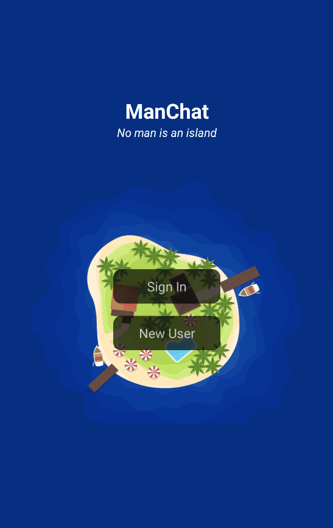

## Description:
miau

## Starting Project:
1. Cloning the repository
-  `git clone git@github.com:Vincenzofdg/ManChat.git`
2. Enter in the directory folder
- `cd ManChat`
3. Install projects dependencies
- `npm install` or `npm ci`
4. Starting localy
- Node Version 16: `npm start`

## Dependencies Used:
1. Styled Components (_npm install react-native-localize_);
2. Image Picker (_npm install react-native-image-picker_)

npm install @react-navigation/native
npm install @react-navigation/bottom-tabs
npm install react-native-video
npm install @react-native-picker/picker  
